<div align="center">


<br/>

[](https://git.io/typing-svg)

<br/>

<p align="center">
  <a href="#"></a>
  <a href="#"></a>
  <a href="#"></a>
  <a href="#"></a>
</p>

<p align="center">
  
</p>

</div>

---


##  &nbsp; About Me


```typescript
const engineer = {
  role: "Senior Frontend Engineer",
  experience: "8+ years in production-grade development",
  focus: [
    "Scalable Frontend Architecture",
    "Reusable Component Systems",
    "Performance Optimization",
    "Modern UI/UX Engineering",
    "Clean Code & Design Patterns",
  ],
  currently: {
    building: "High-performance React & Next.js applications",
    learning: ["Java", "Spring Boot", "Backend System Design"],
    exploring: "Full-stack distributed systems",
  },
  philosophy: "Ship fast. Scale smart. Never compromise on quality.",
};
```

<br clear="right"/>

> **"I don't just build UIs — I engineer experiences that scale, perform, and endure."**

I'm a frontend-focused engineer with **8+ years** of experience crafting production-grade web applications. My expertise spans the full modern frontend ecosystem — from architecting **scalable component libraries** and **optimized rendering pipelines** to building pixel-perfect, accessible interfaces.

I obsess over **developer experience**, **maintainable codebases**, and **high-performance interfaces** that delight users and hold up under real-world load. Currently expanding into backend engineering with Java & Spring Boot to evolve into a well-rounded full-stack engineer.

<br/>

---


##  &nbsp; Tech Stack

<div align="center">

### ⚡ Core Languages

<p>
  
  
  
  
  
</p>

### 🚀 Frameworks & Libraries

<p>
  
  
  
  
  
  
</p>

### 🎨 Styling & UI

<p>
  
  
</p>

### 🔧 Tools & Workflow

<p>
  
  
  
  
  
  
</p>

</div>

<br/>

---


## 🏗️ Frontend Expertise

<div align="center">

| Domain | Capabilities |
|--------|-------------|
| **Component Architecture** | Scalable, reusable component systems with atomic design principles |
| **State Management** | TanStack Query for server state, optimized client-side data flows |
| **Performance** | Code splitting, lazy loading, memoization, Core Web Vitals optimization |
| **Type Safety** | Strict TypeScript — interfaces, generics, discriminated unions, utility types |
| **Routing** | React Router v6+, Next.js App Router, advanced layout patterns |
| **Forms & Validation** | React Hook Form with schema validation, complex multi-step form architectures |
| **Styling Systems** | Tailwind CSS utility-first architecture, Mantine UI theming, CSS-in-JS |
| **API Integration** | REST API consumption, caching strategies, optimistic updates |
| **Responsive Design** | Mobile-first, fluid layouts, cross-browser precision |
| **Animations** | CSS transitions, keyframe animations, micro-interactions |

</div>

<br/>

---


## 🌱 Backend Learning Journey

<div align="center">

```
🔄 Current Focus: Backend System Design & Full-Stack Engineering
```

</div>

```
Frontend ──────────────────────────── ████████████████████░░ 90%
TypeScript ──────────────────────────  ███████████████████░░░ 88%
React Ecosystem ────────────────────── ████████████████████░░ 92%
Next.js ──────────────────────────────  ████████████████████░ 90%
Java ────────────────────────────────   ████████░░░░░░░░░░░░░ 35%
Spring Boot ─────────────────────────   ██████░░░░░░░░░░░░░░░ 28%
Backend System Design ───────────────   ███████░░░░░░░░░░░░░░ 32%
```

<br/>

> **Why backend?** Because building truly scalable production systems requires understanding the full stack. I'm engineering my way from frontend mastery to full-stack fluency — one service at a time.

<p align="center">
  
  
  
</p>

<br/>

---


## ⚙️ Tools & Workflow

```mermaid
graph LR
    A[📋 Design\nFigma] --> B[🧱 Component\nArchitecture]
    B --> C[⚡ TypeScript\nDevelopment]
    C --> D[🎨 Styling\nTailwind + Mantine]
    D --> E[🔗 API\nIntegration]
    E --> F[✅ Testing\n& Review]
    F --> G[🚀 Deploy\nProduction]
    G --> H[📊 Monitor\n& Iterate]

    style A fill:#1e1b4b,stroke:#7c3aed,color:#c4b5fd
    style B fill:#1e1b4b,stroke:#7c3aed,color:#c4b5fd
    style C fill:#1e1b4b,stroke:#7c3aed,color:#c4b5fd
    style D fill:#1e1b4b,stroke:#7c3aed,color:#c4b5fd
    style E fill:#1e1b4b,stroke:#7c3aed,color:#c4b5fd
    style F fill:#1e1b4b,stroke:#7c3aed,color:#c4b5fd
    style G fill:#1e1b4b,stroke:#7c3aed,color:#c4b5fd
    style H fill:#1e1b4b,stroke:#7c3aed,color:#c4b5fd
```

<div align="center">



</div>

<br/>

---


## 📊 GitHub Analytics

<div align="center">


</div>

<div align="center">


</div>

<br/>

---


## 📈 Contribution Activity

<div align="center">


</div>

<br/>

<div align="center">
  <picture>
    <source media="(prefers-color-scheme: dark)" srcset="https://raw.githubusercontent.com/yourusername/yourusername/output/github-contribution-grid-snake-dark.svg" />
    <source media="(prefers-color-scheme: light)" srcset="https://raw.githubusercontent.com/yourusername/yourusername/output/github-contribution-grid-snake.svg" />
    
  </picture>
</div>

<br/>

---


## 🚀 Featured Projects

<div align="center">

<a href="https://github.com/yourusername/project-one">
  
</a>
<a href="https://github.com/yourusername/project-two">
  
</a>

</div>

<br/>

### 🔥 Highlighted Work

| Project | Stack | Highlights |
|---------|-------|------------|
| **Enterprise Dashboard** | Next.js · TypeScript · TanStack Query · Tailwind | Role-based auth, real-time data, reusable chart system |
| **Design System** | React · TypeScript · Mantine UI · Storybook | 50+ components, theming engine, a11y compliant |
| **E-Commerce Platform** | Next.js · React Hook Form · REST APIs | SSR/SSG hybrid, cart logic, payment integration |
| **Admin CMS** | React · TypeScript · TanStack Query | Infinite scroll, optimistic updates, drag-and-drop |
| **Micro-Frontend Shell** | React · React Router · Tailwind | Module federation, shared state, dynamic routing |

<br/>

---


## 🎯 Open Source Goals

<p align="center">
  
  
  
  
</p>

```
🔲  Publish open-source React component library with full TypeScript support
🔲  Contribute to TanStack Query / React Router ecosystems
🔲  Release reusable Next.js starter templates for enterprise projects
🔲  Write in-depth engineering articles on frontend architecture
🔲  Mentor junior engineers through open-source collaboration
✅  Building production-grade projects as public references
✅  Sharing engineering insights and code patterns
```

<br/>

---


## 💡 Developer Philosophy

<div align="center">

```
┌─────────────────────────────────────────────────────────────────┐
│                                                                   │
│   " The best frontend code is invisible to the user —           │
│     they only feel its speed, clarity, and reliability. "       │
│                                                                   │
└─────────────────────────────────────────────────────────────────┘
```

</div>

<br/>

<table>
<tr>
<td width="50%">

**🏛️ Architecture First**
> I design components with longevity in mind. Every abstraction is intentional, every prop API deliberate. Systems that are easy to extend are hard to break.

**⚡ Performance is Non-Negotiable**
> Sub-second load times aren't a luxury — they're a standard. I optimize from the render cycle to the network layer.

</td>
<td width="50%">

**🧹 Clean Code is Kind Code**
> Readable, self-documenting code is a gift to your future self and your team. I write code that communicates intent clearly.

**🔄 Continuous Iteration**
> Software is never done. I embrace feedback loops, observability, and iterative refinement as core engineering values.

</td>
</tr>
</table>

<br/>

---


## 🤝 Let's Connect

<div align="center">

<br/>

> **"I'm always open to exciting frontend challenges, architecture discussions, and meaningful collaborations."**

<br/>

<p>
  <a href="https://linkedin.com/in/yourprofile">
    
  </a>
  &nbsp;
  <a href="mailto:your@email.com">
    
  </a>
  &nbsp;
  <a href="https://yourportfolio.dev">
    
  </a>
  &nbsp;
  <a href="https://twitter.com/yourhandle">
    
  </a>
</p>

<br/>

<table>
<tr>
<td align="center">💼</td>
<td><strong>Open to</strong> senior frontend roles, tech lead positions & remote opportunities</td>
</tr>
<tr>
<td align="center">🤝</td>
<td><strong>Collaborate</strong> on production-grade React/Next.js applications & open-source projects</td>
</tr>
<tr>
<td align="center">📚</td>
<td><strong>Discuss</strong> frontend architecture, performance engineering & modern UI systems</td>
</tr>
<tr>
<td align="center">✍️</td>
<td><strong>Share</strong> engineering insights, code patterns & real-world lessons</td>
</tr>
</table>

<br/>

</div>

---

<div align="center">


<br/>

<sub>
  
  &nbsp;
  
</sub>

</div>
